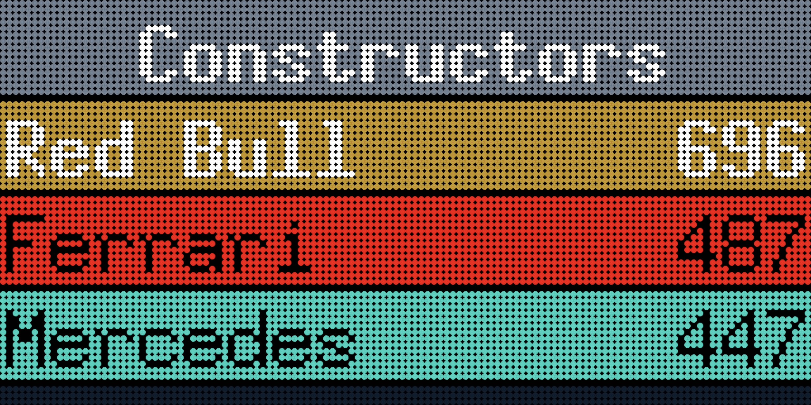
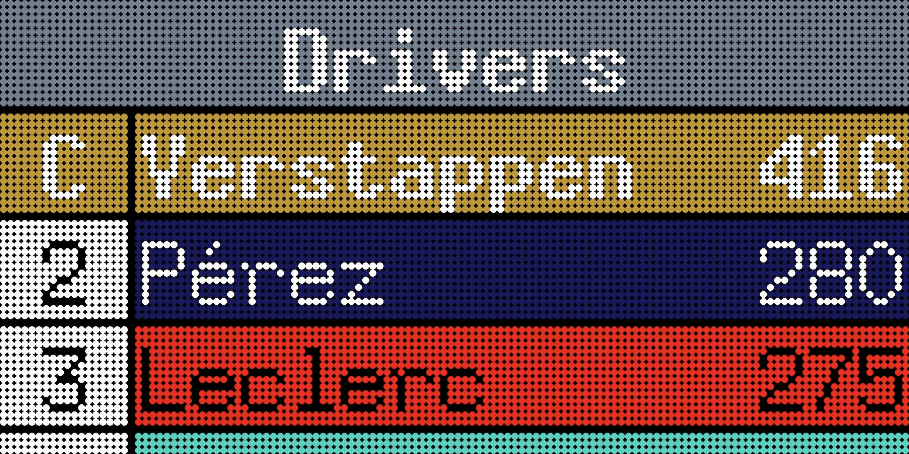
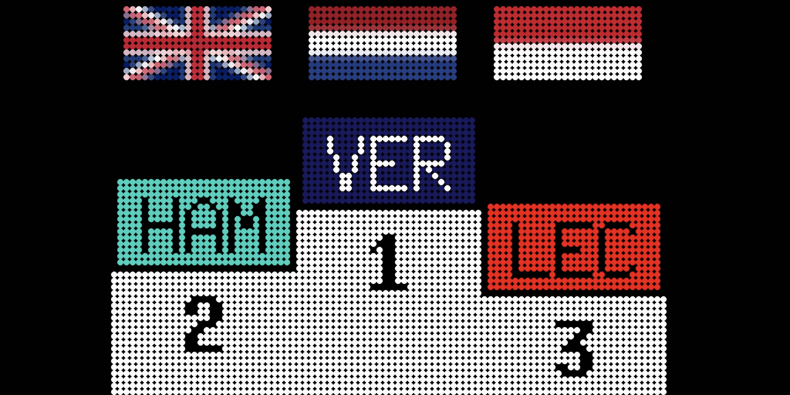
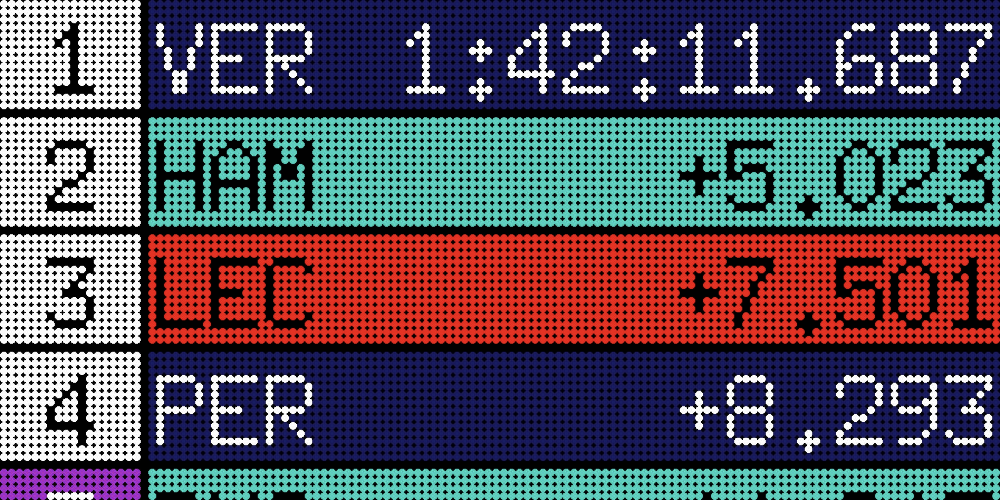
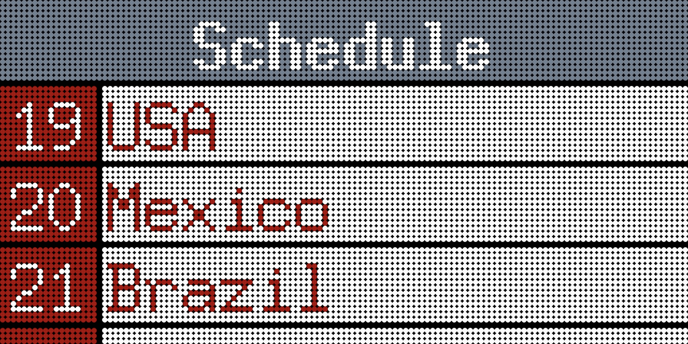
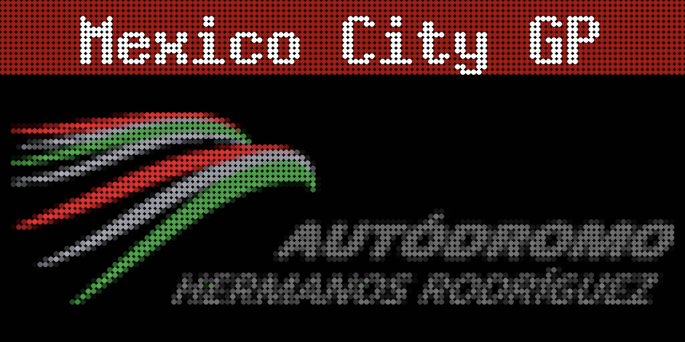
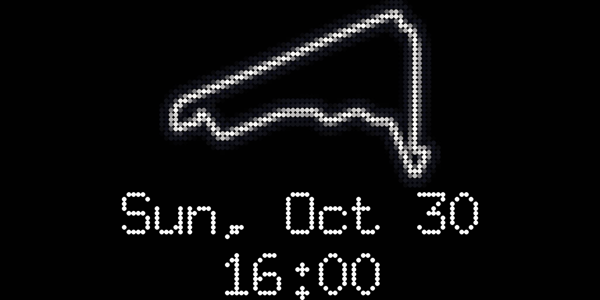
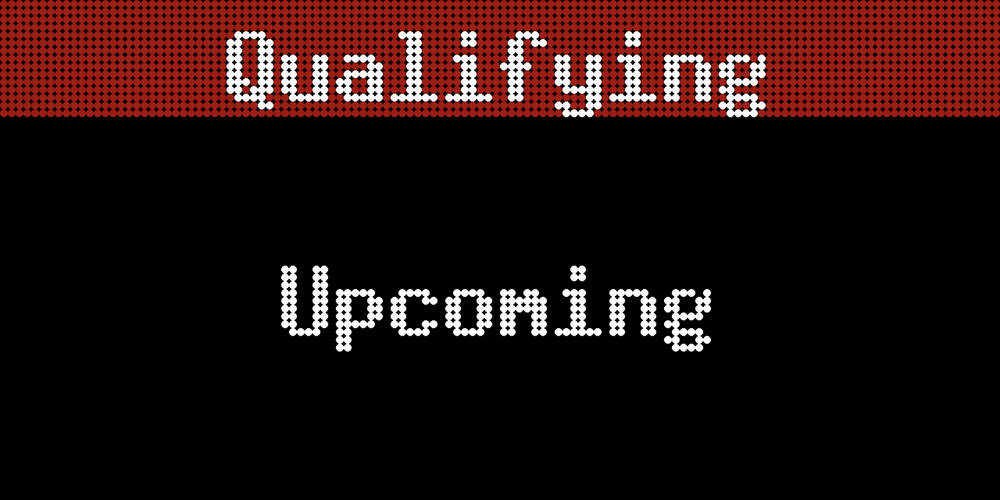
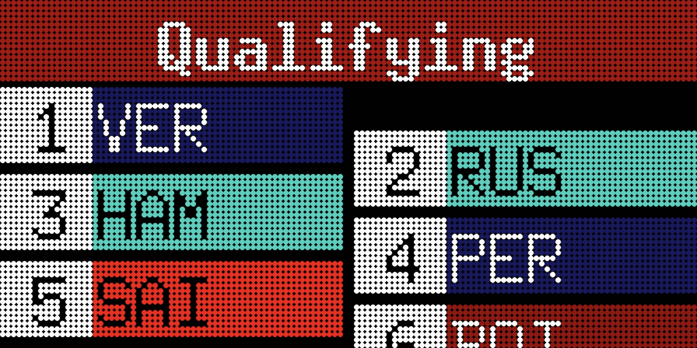

# F1 LED Leaderboard


An application to display Formula 1 constructor & driver standings, season schedule, qualifying & race results on a 
Raspberry Pi driven RGB LED matrix board.

## Table of Contents
* [Features](#features)
* [Installation](#installation)
  * [Hardware](#hardware)
  * [Software](#software)
* [Usage](#usage)
  * [Flags](#flags)
  * [Execution](#execution)
  * [Debug](#debug)
* [Sources](#sources)
* [Disclaimer](#disclaimer)
* [License](#license)

## Features
- **Constructor Standings**

<p align="center">
  
</p>

- **Driver Standings**

<p align="center">
  
</p>

- **Grand Prix Results**

<p align="center">
  
  
  
</p>

- **Schedule**

<p align="center">
  
</p>

- **Next Grand Prix Information**

<p align="center">
  
  
</p>

- **Qualifying & Sprint Results**

<p align="center">
  
  
</p>

## Installation
### Hardware
Materials needed:
- [Raspberry Pi] (Only tested on 3B+ and 4B, but should work on other models)
- Adafruit RGB Matrix [HAT] or [Bonnet]
- RGB LED matrix (62×32 or 128×64)

### Software
**Pre-requisites**

- Git
- PIP
- Python 3.8+

```sh
sudo apt-get update
sudo apt-get install git python3-pip -y
```

**Installation**

First, clone this repository. Using the `--recursive` flag will install the rgbmatrix binaries, which come from
hzeller's [rpi-rgb-led-matrix] library. This library is used to render the data onto the LED matrix.

```sh
git clone --recursive https://github.com/feram18/f1-led-leaderboard.git
cd f1-led-leaderboard
chmod +x install.sh
./install.sh
```

**Updating**

From the `f1-led-leaderboard` directory, run the update script. The script will also take care of updating dependencies.

```sh
./update.sh
```

## Usage
Make sure the timezone on your Raspberry Pi is correct. It will often have it as London by default, but can be changed 
through the Raspberry Pi configuration tool.

`Localisation Options > Timezone > [Your Time Zone]`

```sh
sudo raspi-config
```

### Flags
The LED matrix is configured with the flags provided by the [rpi-rgb-led-matrix] library. 
More details on these flags can be found in the library's documentation.

```
--led-rows                Display panel rows. (Default: 32)
--led-cols                Display panel columns. (Default: 64)
--led-multiplexing        Multiplexing type: 0 = direct; 1 = strip; 2 = checker; 3 = spiral; 4 = Z-strip; 5 = ZnMirrorZStripe; 6 = coreman; 7 = Kaler2Scan; 8 = ZStripeUneven. (Default: 0)
--led-row-addr-type       Addressing of rows: 0 = default; 1 = AB-addressed panels. (Default: 0)
--led-panel-type          Chipset of the panel. Supported panel types: FM6126A; FM6127.
--led-gpio-mapping        Name of GPIO mapping used: regular, adafruit-hat, adafruit-hat-pwm, compute-module. (Default: regular)
--led-slowdown-gpio       Slow down writing to GPIO. Needed for faster Pi's and/or slower panels. Range: 0..4. (Default: 1)
--led-chain               Number of daisy-chained boards. (Default: 1)
--led-parallel            For Plus-models or RPi2: parallel chains. 1..3. (Default: 1)
--led-pixel-mapper        Apply pixel mappers: Mirror (Horizontal) = "Mirror:H"; Mirror (Vertical) = "Mirror:V"; Rotate (Degrees) = eg. "Rotate: 90"; U-Mapper = "U-mapper"
--led-brightness          Brightness level. Range: 1..100. (Default: 100)
--led-pwm-bits            Bits used for PWM. Range 1..11. (Default: 11)
--led-show-refresh        Shows the current refresh rate of the LED panel.
--led-limit-refresh       Limit refresh rate to this frequency in Hz. Useful to keep a constant refresh rate on loaded system. 0=no limit. (Default: 0)
--led-scan-mode           Progressive or interlaced scan. 0 = Progressive, 1 = Interlaced. (Default: 1)
--led-pwm-lsb-nanosecond  Base time-unit for the on-time in the lowest significant bit in nanoseconds. (Default: 130)
--led-pwm-dither-bits     Time dithering of lower bits. (Default: 0)
--led-no-hardware-pulse   Don't use hardware pin-pulse generation.
--led-inverse             Switch if your matrix has inverse colors on.
--led-rgb-sequence        Switch if your matrix has led colors swapped. (Default: RGB)
```

### Execution
From the `f1-led-leaderboard` directory run the command

```sh
sudo python3 main.py --led-gpio-mapping="adafruit-hat" --led-slowdown-gpio=2
```
Modify and include [flags](#Flags) as needed for your particular setup. Running as root is necessary in order for the 
matrix to render. Privileges are dropped after initialization.

### Debug
If you are experiencing issues, enable debug messages by appending the `--debug` flag to your execution command, logs 
are written to the `f1-led-leaderboard.log` file.

## Roadmap
- [X] Race Schedule
- [X] Grand Prix Results
- [X] Grand Prix Qualifying Results
- [X] 128×64 Layout
- [ ] World Drivers' Championship Winner
- [ ] World Constructors' Championship Winner
- [ ] Customization options
  - [ ] Favorite Constructor Summary

## Sources
This project relies on the following:
- [Jolpica API] to retrieve Formula 1 data.
- [rpi-rgb-led-matrix] library to make everything work with the LED matrix. It is included into this repository as a 
  submodule.

## Limitations
Unfortunately [Jolpica API] does not provide live data, though it is updated within a few hours after results are up.

## Disclaimer
This application is dependent on the [Jolpica API] relaying accurate and updated data.

## License
GNU General Public License v3.0

[Raspberry Pi]: <https://www.raspberrypi.org/products/>
[64×32]: <https://www.adafruit.com/product/2279>
[HAT]: <https://www.adafruit.com/product/2345>
[Bonnet]: <https://www.adafruit.com/product/3211>
[Jolpica API]: <https://github.com/jolpica/jolpica-f1>
[rpi-rgb-led-matrix]: <https://github.com/hzeller/rpi-rgb-led-matrix>